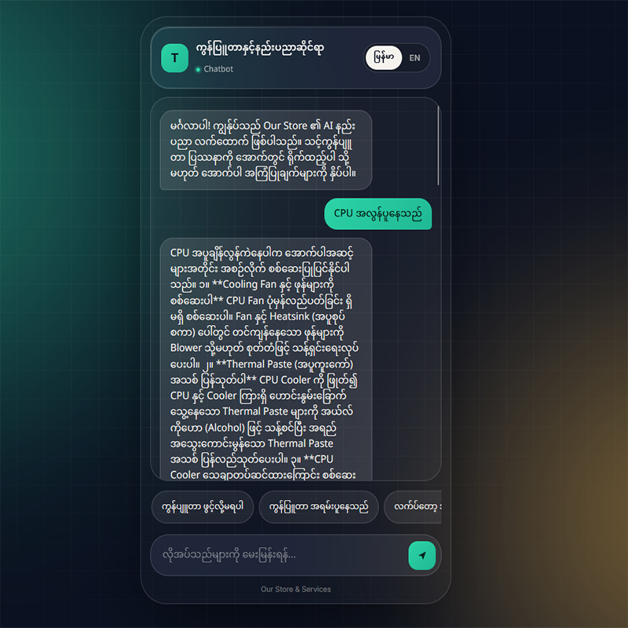
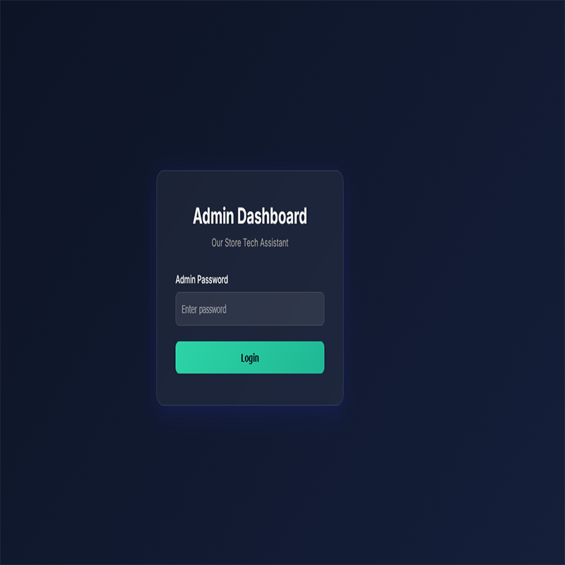
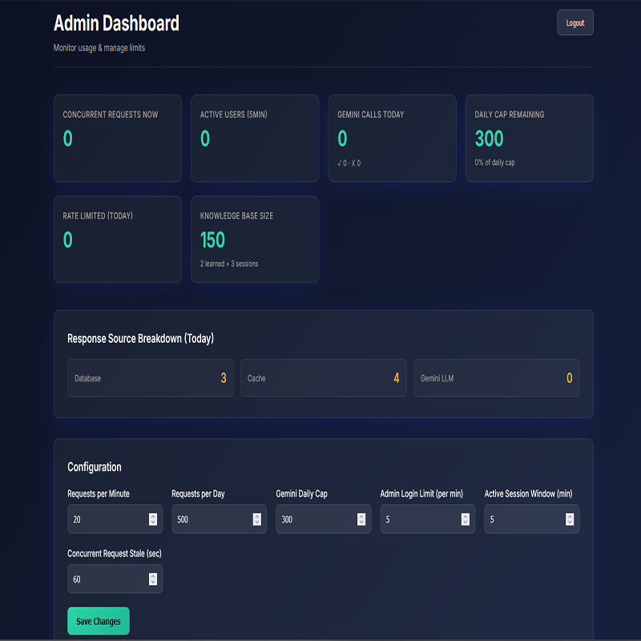

# Burmese PC Troubleshooting Chatbot

**A bilingual (Burmese / English) first-response support bot for computer repair shops — it answers the everyday hardware, software, and network questions so technicians only have to handle the hard ones, and gets cheaper to run the longer it's used.**


---

## The problem

Computer repair shops get the same handful of customer questions every day: the PC won't turn on, the screen stays black, Windows won't boot, the internet keeps dropping, a program won't install. Customers message at all hours, and in many places they write in their own language rather than English.

Most of these problems have a simple first fix. But answering each one by hand takes technician time away from repairs that genuinely need it. And most chatbot tools either handle languages like Burmese poorly, or charge per message in a way that doesn't make sense for a small business.

## What I built

A web chatbot that walks customers through common troubleshooting in Burmese or English, switchable with one click. It covers four areas:

- **PC hardware** — power, display, overheating, component failures
- **Software** — operating system, drivers, applications
- **Networking** — connectivity, Wi-Fi, local network issues
- **Installation** — setting up software and systems

It answers first from a knowledge base of **150 curated troubleshooting entries**. When a question isn't covered, it asks Gemini — and saves that answer, so the next person with the same question gets it instantly and for free.


### At a glance

- **Bilingual** — Burmese and English, with automatic language detection and a one-click toggle
- **Learns from real use** — every new question answered by Gemini is cached, so the bot handles more on its own over time
- **Cost-aware by design** — knowledge base → learned answers → LLM, so paid API calls happen only for genuinely new questions
- **Operationally controlled** — rate limiting, a daily Gemini call cap, and an admin dashboard to tune both without redeploying
- **Tested** — 169 tests, 92% backend coverage, with a 70% coverage gate
- **One-command deployment** — Docker Compose with Nginx in front of Flask

## Screenshots

<table>
  <tr>
    <td align="center"><br><b>Chat UI</b></td>
    <td align="center"><br><b>Admin Login</b></td>
    <td align="center"><br><b>Admin Dashboard</b></td>
  </tr>
</table>

## How it works

The bot answers from two layers of stored knowledge before it ever calls an LLM:

1. **The knowledge base** — 150 curated entries, loaded at setup. This layer is fixed and controlled; it only changes when someone deliberately edits it.
2. **Learned answers** — a cache that starts empty and grows as real users ask questions the knowledge base doesn't cover. Each Gemini answer is saved here and reused next time.

```
User question (Burmese or English)
        ↓
Language detection
        ↓
Search knowledge base (150 curated entries)
        ↓
Found? ──Yes──→ Return solution              (instant, free)
        │
        No
        ↓
Search learned answers (grows with use)
        ↓
Found? ──Yes──→ Return learned answer        (instant, free)
        │
        No
        ↓
Call Gemini ──→ Generate answer → Save as learned answer → Return
```

Keeping the two layers separate is deliberate: the curated knowledge base stays clean and trustworthy, while the learned layer adapts to what customers actually ask. The admin dashboard shows which layer each answer came from, so you can watch the share of paid Gemini calls fall as the bot learns.

## Design decisions

### Knowledge base first, LLM last

Most customer problems repeat. Sending every question to an LLM would be slower, more expensive, and less predictable than answering from entries already known to be correct. The LLM handles the long tail — questions the stored layers don't cover — rather than acting as the main engine.

### Learned answers kept separate from curated knowledge

Gemini's answers are saved to their own table rather than merged into the knowledge base. That way the curated entries are never silently changed by LLM output, and learned answers can be inspected, cleared, or later promoted into the knowledge base on purpose.

### Character n-gram matching for Burmese

Burmese is written without spaces between words, so the usual first step in text matching — splitting a sentence into words — doesn't work reliably. Instead, the engine compares overlapping character sequences (n-grams) between the question and each stored entry. English questions use normal word matching.

### Gemini as the fallback model

Gemini handles Burmese well, and its free tier keeps running costs low. I also considered MyanmarGPT, an open-source Burmese language model, but at 128M parameters it's built for general text generation rather than the step-by-step reasoning that troubleshooting needs.

### SQLite for storage

SQLite is a single file with no separate database server to run. That keeps the deployment to two containers and is more than enough for a single shop's traffic. The database lives in a Docker volume, so chat history and learned answers survive restarts and rebuilds.

### An admin dashboard for cost control

Gemini calls cost money, so they need to be visible and controllable. The dashboard shows live metrics — active sessions, today's Gemini call count, and which layer answers are coming from — and lets an admin change rate limits and the daily Gemini cap without touching code or redeploying.

## Limitations

- **Web chat only, for now.** Sessions already record which platform a message came from, but the Facebook, TikTok, Line, and Viber webhooks aren't built yet.
- **Learned answers are reused as-is.** There's currently no review step, so a weak Gemini answer would be repeated until someone removes it.
- **Burmese matching is sensitive to wording.** Because matching works on character overlap, rewording a knowledge-base entry can change which questions it matches.
- **Knowledge-base edits need a manual re-seed.** Seed data is only loaded into an empty database (see [docs/OPERATIONS.md](docs/OPERATIONS.md)).
- **Single instance.** SQLite suits one shop, not a horizontally scaled deployment.

## What's next

- Messaging-platform webhooks, starting with Facebook Messenger
- An admin review queue, so learned answers can be approved, corrected, or promoted into the curated knowledge base
- Voice input and output (hooks exist in `gemini.py`, not yet implemented)
- Integration with a point-of-sale system, so conversations can connect to real repair tickets

## Tech stack

| Layer | Technology |
|---|---|
| Backend | Python, Flask |
| Database | SQLite |
| AI | Google Gemini (fallback answers and translation) |
| Frontend | HTML, CSS, JavaScript |
| Web server | Nginx (serves frontend, proxies `/api` and `/health`) |
| Deployment | Docker Compose |
| Testing | pytest, pytest-cov |

## Quick start

```bash
git clone https://github.com/inkychalk/Burmese-PC-Troubleshooting-Chatbot.git
cd Burmese-PC-Troubleshooting-Chatbot
cp .env.example .env          # Windows cmd: copy .env.example .env
# Open .env and fill in GEMINI_API_KEY, ADMIN_PASSWORD, SECRET_KEY
docker compose up -d
```

| Service | URL |
|---|---|
| Chat UI | http://localhost |
| Admin dashboard | http://localhost/admin.html |
| Backend API | http://localhost:5000 |
| Health check | http://localhost/health |

### Configuration

| Variable | Purpose |
|---|---|
| `GEMINI_API_KEY` | Gemini access for fallback answers and translation |
| `ADMIN_PASSWORD` | Password for the admin dashboard |
| `SECRET_KEY` | Flask session signing |

Without a Gemini key, the bot still works from the knowledge base and any learned answers already stored — it just can't answer brand-new questions.

## API

| Method | Endpoint | Purpose |
|---|---|---|
| `GET` | `/health` | Health check |
| `POST` | `/api/chat` | Main chat endpoint |
| `POST` | `/api/translate` | Translate text between Burmese and English |
| `GET` | `/api/categories` | List troubleshooting categories |

Example chat request:

```json
{
  "message": "computer won't turn on",
  "language": "en",
  "platform": "web",
  "user_id": "some_user_id"
}
```

Admin endpoints (session-based login, rate-limited to 5 attempts per minute) are documented in [docs/OPERATIONS.md](docs/OPERATIONS.md#admin-dashboard-api).

## Project structure

```
Burmese-PC-Troubleshooting-Chatbot/
├── backend/
│   ├── app.py                     # Flask app and routes
│   ├── api/admin.py               # Admin auth, metrics, config
│   ├── database/models.py         # Schema, learned-answer cache, sessions, rate limiting
│   ├── troubleshooting/engine.py  # Burmese n-gram + English matching
│   └── integrations/gemini.py     # Gemini fallback and translation
├── frontend/                      # Chat UI and admin dashboard
├── docker/                        # Dockerfile and nginx.conf
├── tests/                         # 169 tests
├── docs/
│   ├── OPERATIONS.md              # Running, maintaining, troubleshooting
│   └── screenshots/
├── troubleshooting_data.json      # Knowledge-base seed data (150 entries)
├── docker-compose.yml
├── SECURITY.md
├── TESTING.md
└── PRE_DEPLOYMENT_CHECKLIST.md
```

## Testing

```bash
pip install -r requirements-test.txt
pytest --cov=backend --cov-report=term-missing
```

169 tests passing, 92% backend coverage, with a 70% minimum enforced. See [TESTING.md](TESTING.md) for the per-module breakdown.

Note: some tests in `tests/test_engine.py` use exact Burmese query strings, because matching depends on character overlap. If you reword `troubleshooting_data.json` and one of those tests fails, the test query usually needs updating — not the code.

## Security

Rate limiting on chat, translation, and login; session-based admin authentication; and security headers including HSTS, CSP, and X-Frame-Options. See [SECURITY.md](SECURITY.md) for the architecture and OWASP Top 10 notes, and [PRE_DEPLOYMENT_CHECKLIST.md](PRE_DEPLOYMENT_CHECKLIST.md) before deploying to production.

## Running and maintaining

Docker commands, database access, updating the knowledge base, and common problems are all in **[docs/OPERATIONS.md](docs/OPERATIONS.md)**.

## About

Built by **Thura** — a network engineer moving into AI development.

[LinkedIn](https://mm.linkedin.com/in/thuya-maung-a787101)
[GitHub](https://github.com/inkychalk)

## License

Released under the [MIT License](LICENSE).
